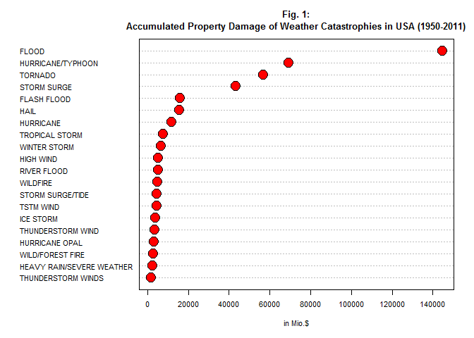
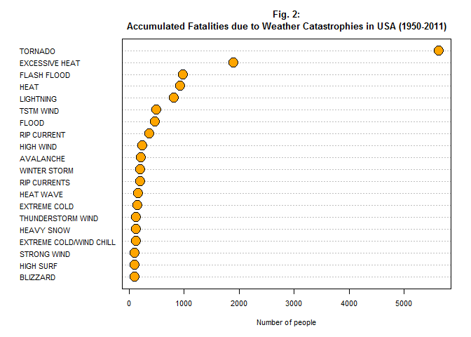
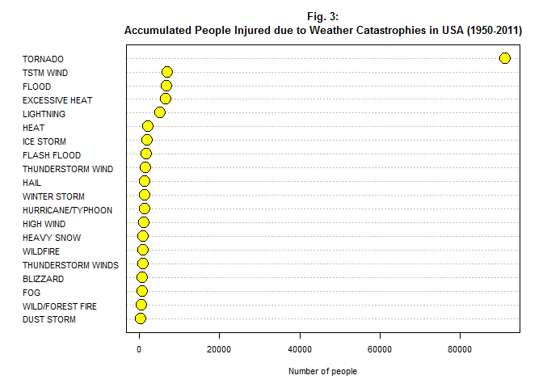

# 60 Years of Weather Catastrophies: How they Harm Health and Economy
Mario  
December 31th,  2016  


### Synopsis

This study investigates the relation between weather catastrophy type and 
damage inflicted on human health and economy. The results show that flood
phenomena are the most dangerous evils for economy.
Considering effects on human health tornados are the most dangerous evildoers - 
both with respect to fatalities and also injuries. It seems that it is easier 
for people to dodge flood occurences than the less predictable and fast tornados. 

### Background

This analysis is based on data provided by the U.S. National Oceanic and Atmospheric
Administration (NOAA). The database contains information on major storms and weather
events in the United States between 1950 and 2011. The goal of this study is
to find out which types of events are most harmful with respect to population
health and economic performance.

### Data Processing

Data Analysis is done with the help of R, a software for statistical programming. 
To be reproducible we include the code we used to obtain the results.

#### Data Extraction

We first load the raw data and select the variables we assume as relevant to the research question.


```r
myData <- read.csv("repdata_data_StormData.csv.bz2", header = TRUE, sep = ",", quote = "\"")
library(dplyr) # load data manipulation functionality
myData2 <- select(myData, EVTYPE, FATALITIES, INJURIES, PROPDMG, PROPDMGEXP) # extract relevant variables
```
Here's the first six cases of the database:


```r
head(myData2) # extract relevant variables
```

```
##    EVTYPE FATALITIES INJURIES PROPDMG PROPDMGEXP
## 1 TORNADO          0       15    25.0          K
## 2 TORNADO          0        0     2.5          K
## 3 TORNADO          0        2    25.0          K
## 4 TORNADO          0        2     2.5          K
## 5 TORNADO          0        2     2.5          K
## 6 TORNADO          0        6     2.5          K
```

We chose the number of fatalities and injuries as indicators of population
health damage and property damage in US Dollars as indicator for economic damage.

#### Data Manipulation

We need to prepare the data for further analysis. The variable PROPDMG
contains the property damage size and the variable PROPDMGEXP gives the measurement unit. According to the storm data documentation, 'K' (Thousand Dollar), 'M' (Million Dollar), and 'B' (Billion Dollar) are valid units for property damage. However, as can be seen from following frequency table the data
contain also other entries not defined:


```r
sort(table(myData2$PROPDMGEXP), decreasing = TRUE) # examine unit of property damage
```

```
## 
##             K      M      0      B      5      1      2      ?      m 
## 465934 424665  11330    216     40     28     25     13      8      7 
##      H      +      7      3      4      6      -      8      h 
##      6      5      5      4      4      4      1      1      1
```

While no entry probably signifies 'no damage' we can assume that 'm' is meant to be 'M'. But there is no clear interpretation available for the other values. We will therefore ignore these cases while we're going to treat 'm' as 'M'.


```r
options(scipen = 999) # no scientific notation
myData2$PROPDMGEXP2[myData2$PROPDMGEXP == 'K'] <- 1000 # factor for PROPDMG is 1.000 etc.
myData2$PROPDMGEXP2[myData2$PROPDMGEXP %in% c('M','m')] <- 1000000
myData2$PROPDMGEXP2[myData2$PROPDMGEXP == 'B'] <- 1000000000
table(myData2$PROPDMGEXP2)
```

```
## 
##       1000    1000000 1000000000 
##     424665      11337         40
```
Now we filter those cases that do have property damage and then  calculate final property damage in million Dollars:


```r
myData3 <- filter(myData2, PROPDMGEXP2 > 999) # Take cases with valid measurement unit of PROPDMGEXP2
myData3$PROPDMG2 <- myData3$PROPDMG * myData3$PROPDMGEXP2/1000000 # Property Damage in Mio.$
head(myData3)
```

```
##    EVTYPE FATALITIES INJURIES PROPDMG PROPDMGEXP PROPDMGEXP2 PROPDMG2
## 1 TORNADO          0       15    25.0          K        1000   0.0250
## 2 TORNADO          0        0     2.5          K        1000   0.0025
## 3 TORNADO          0        2    25.0          K        1000   0.0250
## 4 TORNADO          0        2     2.5          K        1000   0.0025
## 5 TORNADO          0        2     2.5          K        1000   0.0025
## 6 TORNADO          0        6     2.5          K        1000   0.0025
```

## Results

Now we're calculating the sum of property damage in Mio.$ for each type of weather catastrophy.
All in all there are 404 sources mentioned in the database.
Let's look at the 20 most harmful sources of economic damage:


```r
myData4 <- myData3 %>% group_by(EVTYPE) %>% summarise(mioDollar = sum(PROPDMG2)) %>% arrange(mioDollar)
result <- tail(myData4, 20)
print(arrange(result, desc(mioDollar)))
```

```
## # A tibble: 20 × 2
##                       EVTYPE  mioDollar
##                       <fctr>      <dbl>
## 1                      FLOOD 144657.710
## 2          HURRICANE/TYPHOON  69305.840
## 3                    TORNADO  56937.160
## 4                STORM SURGE  43323.536
## 5                FLASH FLOOD  16140.812
## 6                       HAIL  15732.267
## 7                  HURRICANE  11868.319
## 8             TROPICAL STORM   7703.891
## 9               WINTER STORM   6688.497
## 10                 HIGH WIND   5270.046
## 11               RIVER FLOOD   5118.945
## 12                  WILDFIRE   4765.114
## 13          STORM SURGE/TIDE   4641.188
## 14                 TSTM WIND   4484.928
## 15                 ICE STORM   3944.928
## 16         THUNDERSTORM WIND   3483.121
## 17            HURRICANE OPAL   3172.846
## 18          WILD/FOREST FIRE   3001.829
## 19 HEAVY RAIN/SEVERE WEATHER   2500.000
## 20        THUNDERSTORM WINDS   1735.953
```

As can be seen from the table, flood catastrophies (rank 1) are the most harmful 
sources of property damage
with 144.6 Bio.$ estimated damage. Flash Flood (rank 5) and river flood (rank 11)
are still further flood occurrences. Hurricanes, typhoons and tornados also exert 
excessive damage on economy. Let's have this plotted:


```r
dotchart(result$mioDollar,labels=result$EVTYPE,cex=.7,
   main="Fig. 1:\nAccumulated Property Damage of Weather Catastrophies in USA (1950-2011)",
   xlab="in Mio.$", color='black', bg='red', pt.cex = 2)
```

<!-- -->

Let's also investigate effects on human health and calculate
the total number of fatalities for each type of weather catastrophy.


```r
myData5 <- myData2 %>% group_by(EVTYPE) %>% summarise(deaths = sum(FATALITIES)) %>% arrange(deaths)
result <- tail(myData5, 20)
print(arrange(result, desc(deaths)))
```

```
## # A tibble: 20 × 2
##                     EVTYPE deaths
##                     <fctr>  <dbl>
## 1                  TORNADO   5633
## 2           EXCESSIVE HEAT   1903
## 3              FLASH FLOOD    978
## 4                     HEAT    937
## 5                LIGHTNING    816
## 6                TSTM WIND    504
## 7                    FLOOD    470
## 8              RIP CURRENT    368
## 9                HIGH WIND    248
## 10               AVALANCHE    224
## 11            WINTER STORM    206
## 12            RIP CURRENTS    204
## 13               HEAT WAVE    172
## 14            EXTREME COLD    160
## 15       THUNDERSTORM WIND    133
## 16              HEAVY SNOW    127
## 17 EXTREME COLD/WIND CHILL    125
## 18             STRONG WIND    103
## 19                BLIZZARD    101
## 20               HIGH SURF    101
```

From this perspective tornados are the most dangerous live threatening events (5633 fatalities, rank 1)
with excessive heat on the second rank. See also figure 2.

```r
dotchart(result$deaths,labels=result$EVTYPE,cex=.7,
   main="Fig. 2:\nAccumulated Fatalities due to Weather Catastrophies in USA (1950-2011)",
   xlab="Number of people", color='black', bg='orange', pt.cex = 2)
```

<!-- -->

A third and last point of view is related to the number of people who suffered injuries 
from weather catastrophies. Let's tabulate this, as well:

```r
myData6 <- myData2 %>% group_by(EVTYPE) %>% summarise(injury = sum(INJURIES)) %>% arrange(injury)
result <- tail(myData6, 20)
print(arrange(result, desc(injury)))
```

```
## # A tibble: 20 × 2
##                EVTYPE injury
##                <fctr>  <dbl>
## 1             TORNADO  91346
## 2           TSTM WIND   6957
## 3               FLOOD   6789
## 4      EXCESSIVE HEAT   6525
## 5           LIGHTNING   5230
## 6                HEAT   2100
## 7           ICE STORM   1975
## 8         FLASH FLOOD   1777
## 9   THUNDERSTORM WIND   1488
## 10               HAIL   1361
## 11       WINTER STORM   1321
## 12  HURRICANE/TYPHOON   1275
## 13          HIGH WIND   1137
## 14         HEAVY SNOW   1021
## 15           WILDFIRE    911
## 16 THUNDERSTORM WINDS    908
## 17           BLIZZARD    805
## 18                FOG    734
## 19   WILD/FOREST FIRE    545
## 20         DUST STORM    440
```

Again, tornados are the clear number one cause of injuries resulting from weather phenomena
(91346 injured people, rank 1). This will also be shown graphically (see figure 3):


```r
dotchart(result$injury,labels=result$EVTYPE,cex=.7,
   main="Fig. 3:\nAccumulated People Injured due to Weather Catastrophies in USA (1950-2011)",
   xlab="Number of people", color='black', bg='yellow', pt.cex = 2)
```

<!-- -->
